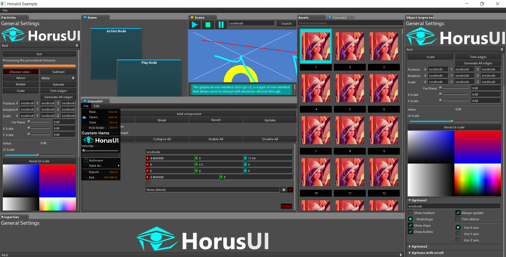

# Immediate Mode Graphical User Interface for Tools



## OVERVIEW
The HorusUI library allows you to quickly develop GUIs for your applications by leveraging the ease of use provided by immediate mode GUI concepts. No need to design your GUI layout and writing many lines of boilerplate GUI preparation, imgui takes care of layouting and making sure every widget you add to the system has an unique ID, gets drawn and responds to events.
Ideally you should be familiar with https://en.wikipedia.org/wiki/Immediate_Mode_GUI. There are other imgui libs out there, dear-imgui which is more like a debug GUI and Nuklear which resembles HorusUI.
HorusUI was specifically designed to create game editor tools or similar types of applications.

```NOTE: The library is still work in progress, drastic changes will occur until stabilization```

## QUICK SAMPLE (C++)

```C++
    auto huiCtx = hui::createContext(hui::GraphicsApi::OpenGL);
    auto wnd = hui::createWindow("Sample", 1000, 800);
    hui::setWindow(wnd);
    auto theme = hui::loadTheme("../themes/default.theme");
    hui::setTheme(theme);

    auto largeFnt = hui::getFont(theme, "title");

    while (true)
    {
        hui::processEvents();
        hui::setWindow(hui::getMainWindow());
        hui::beginWindow(hui::getMainWindow());

        // user drawing code
        glClearColor(0, .3, .2, 1);
        glClear(GL_COLOR_BUFFER_BIT);

	// horus ui
        hui::beginFrame();
        hui::Rect panelRect = { 50, 50, 350, 500 };
        hui::beginContainer(panelRect);
        hui::WidgetElementInfo elemInfo;
        hui::getThemeWidgetElementInfo(hui::WidgetElementId::PopupBody, hui::WidgetStateType::Normal, elemInfo);
        hui::setBackColor(hui::Color::white);
        hui::drawBorderedImage(elemInfo.image, elemInfo.border, panelRect);
        hui::pushPadding(15);
        hui::gap(15);
        hui::labelCustomFont("Information", largeFnt);
        hui::button("Activate shields");
        static bool chk1, chk2, chk3;
        hui::beginTwoColumns();
        chk1 = hui::check("Option 1", chk1);
        chk2 = hui::check("Option 2", chk2);
        hui::nextColumn();
        chk3 = hui::check("Option 3", chk3);
        hui::pushTint(hui::Color::cyan);
        hui::button("Browse...");
        hui::popTint();
        hui::endColumns();
        static float val;
        hui::sliderFloat(0, 100, val);
        static char txt[2000];
        hui::textInput(txt, 2000, hui::TextInputValueMode::Any, "Write something here");
        hui::space();

        static f32 scrollPos = 0;
        hui::beginScrollView(200, scrollPos);
        hui::multilineLabel("Lorem ipsum dolor sit amet, consectetur adipiscing elit, sed do eiusmod tempor incididunt ut labore et dolore magna aliqua. Ut enim ad minim veniam, quis nostrud exercitation ullamco laboris nisi ut aliquip ex ea commodo consequat. Duis aute irure dolor in reprehenderit in voluptate velit esse cillum dolore eu fugiat nulla pariatur?", hui::HAlignType::Left);
        hui::line();
        hui::button("I AGREE");
        scrollPos = hui::endScrollView();

        if (hui::button("Exit"))
            hui::quitApplication();

        hui::popPadding();
        hui::endContainer();
        hui::endFrame();
        hui::endWindow();
        hui::presentWindow(hui::getMainWindow());

        if (hui::wantsToQuit() || hui::mustQuit())
            break;
    }

    hui::shutdown();
```

## PREREQUISITES
**Windows:**
	Microsoft Visual Studio 2017

**Linux:**
g++

GTK3 dev, needed for the nativefiledialog lib, use:
		```sudo apt-get install libgtk-3-dev```

GLU/GLUT dev, needed by GLEW, use:
		```sudo apt-get install libglu1-mesa-dev freeglut3-dev mesa-common-dev```
	
libudev-dev, needed by SFML

## BUILDING
**Windows:**
- Execute: ```generate.bat```
- Open and compile: ```build_vs2017/horus.sln```
- Run generated files from ```./bin``` folder

**Linux:**
- Execute: ```sh ./generate.sh``` to generate makefiles
- Execute: ```sh ./build.sh``` to compile and generate the lib and executables for the examples
- Run generated files from the ```./bin``` folder

## FEATURES
- Immediate mode GUI, imgui (no state kept per widget, user provides the state)
- Docking OS native windows and tab panes system
- UTF8 text support
- It can redraw the UI only when needed, useful for non-gaming applications where continuous rendering not needed
- DPI aware, scaling of the whole UI elements, useful for high DPI screens
- Fully customizable through themes specified in a JSON file with 9-cell resizable elements and PNG images
- Dynamic font atlas for unlimited unicode glyphs and font sizes
- Widgets: text input (with hint text), tooltip, box, popup, messagebox, progress, button, icon button, dropdown, menu, context menu, tab, panel, radio, check, slider, toolbar etc.
- MegaWidgets: color picker, XYZ/XY editor, object reference editor (with dragdrop support)
- Widgets color tinting override
- Virtual list view support (huge number of items)
- Automatic vertical layouting of widgets (no need to position them by hand)
- Multi-column layout with custom sizes (preferred, fill, max size, percentage based or pixel based)
- Padding (left-right) and vertical spacing for widgets
- Native Open/Save/Pick folder dialogs API
- Inter-widget drag and drop
- OS file/text drag and drop
- Currently using OpenGL and SDL as backends for rendering and window/input
- Customizable render/input backends
- Custom user widgets API
- 2D primitive drawing, lines, polylines, hermite splines, elipses, rectangles, with thickness
- User viewport widget (rendering your scene/document view with the current rendering API)
- Custom mouse cursor API
- Clipboard API
- Single header API
- C-like API

## ROADMAP
- Undo/Redo system
- Keyboard shortcuts system
- OSX proper support
- Vulkan rendering backend
- Better unicode input (show IME suggestion box for Chinese etc.)
- DPI theme elements based on current UI scale, choose the proper element bitmap size
- Multiline text input editor with highlighting, advanced text operations
- Hyperlink widget
- Rich text widget (multi-font family, style and size, multi-color, insert images and hyperlinks)
- Customizable Object Inspector
- Customizable Node Editor
